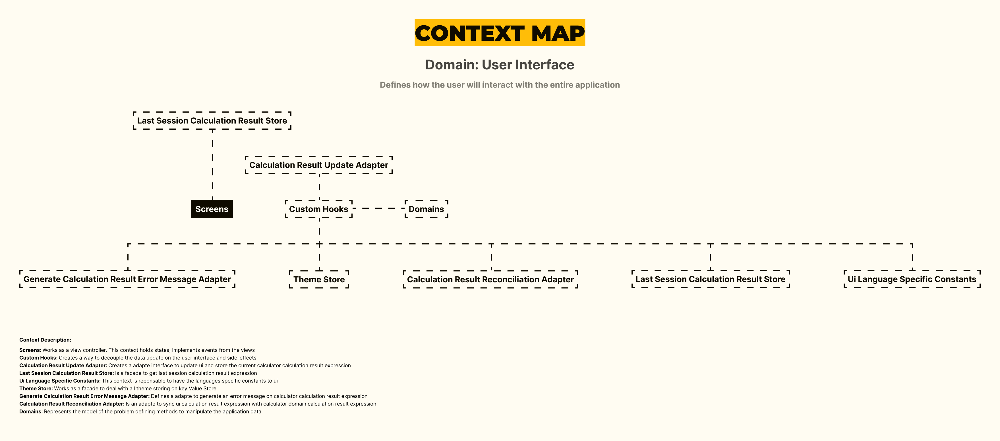

<h1 align="center">
Calculator App With React Native, Expo, Custom Hooks, Typescript, Async Storage, Prettier, Eslint, EditorConfig, Jest, Hexagonal Architecture
</h1>

 

 

  <a href="#description">✍️ Description</a> &nbsp;&nbsp;&nbsp;|&nbsp;&nbsp;&nbsp <a href="#install">🔍 Install</a> &nbsp;&nbsp;&nbsp;|&nbsp;&nbsp;&nbsp <a href="#technologies">🚀 Technologies</a> &nbsp;&nbsp;&nbsp;|&nbsp;&nbsp;&nbsp <a href="#related">♟️ Related</a> &nbsp;&nbsp;&nbsp;|&nbsp;&nbsp;&nbsp <a href="#contact">✉️ Contact</a>

 
 

<h3 id="description">✍️ Description:</h3>

This project has a really solid set of tools and cover a wide range of users usage scenarios; from internationalization to responsiveness. My main goal was to land the best in terms of software architecture - following the Flux Architecture; but also leveraging the most of Clean Architecture, with hexagonal architecture, and Domain Driven Design (DDD) - dealing with an idiomatic model of ubiquitous language. Create the custom hooks was the suitable was of measure the side effects and ui updating elegantly.

 

<h3 id="install">🔍 Install:</h3>

To use all projects environment, run the following commands:

**To install the package:**

`npm install`

**To Start Development Script:**

`./development.sh`

**If you want to create production build:**

`./production.sh`

**To Run The Tests:**

`./testing.sh`

 

<h3 id="technologies">🚀 Technologies:</h3>

To build this project is used:

- React Native
- Expo
- Typescript
- Custom Hooks
- Eslint
- Prettier
- EditorConfig
- Jest Js
- React Native Testing Library
- Async Storage
- Babel Js

 

<h3 id="related">♟️ Related:</h3>

See more:

<ul>
  <li><a href="https://github.com/samueldecarvalhodeveloper/Calculator-App-With-Jetpack-Compose-Kotlin-Material-3-JUnit-Mockk-Dagger-2-Coroutines-Ui-Automator">Calculator App With Jetpack Compose</a></li>
  <li><a href="https://github.com/samueldecarvalhodeveloper/Matrix-Multiplication-Algorithm-With-Haskell-Cabal-Docker-Compose-EditorConfig-Fuctional-Programming">Matrix Multiplication With OCaml</a></li>
  <li><a href="https://github.com/samueldecarvalhodeveloper/Pokedex-API-With-Elixir-PHP-Python-Laravel-Phoenix-FastAPI-Uvicorn-Asyncio-Unittest-PHP-Unit-Docker">Pokedex Api With Laravel</a></li>
</ul>

 

<h3 id="contact">✉️  Contact:</h3>

**Email:**
<a href="mailto:personal.samuelcarvalho@gmail.com">personal.samuelcarvalho@gmail.com</a>

 
 

<strong>Repository Link:</strong>

[https://github.com/samueldecarvalhodeveloper/Calculator-App-With-React-Native-Expo-Custom-Hooks-Typescript-Async-Storage-Prettier-Eslint](https://github.com/samueldecarvalhodeveloper/Calculator-App-With-React-Native-Expo-Custom-Hooks-Typescript-Async-Storage-Prettier-Eslint)
